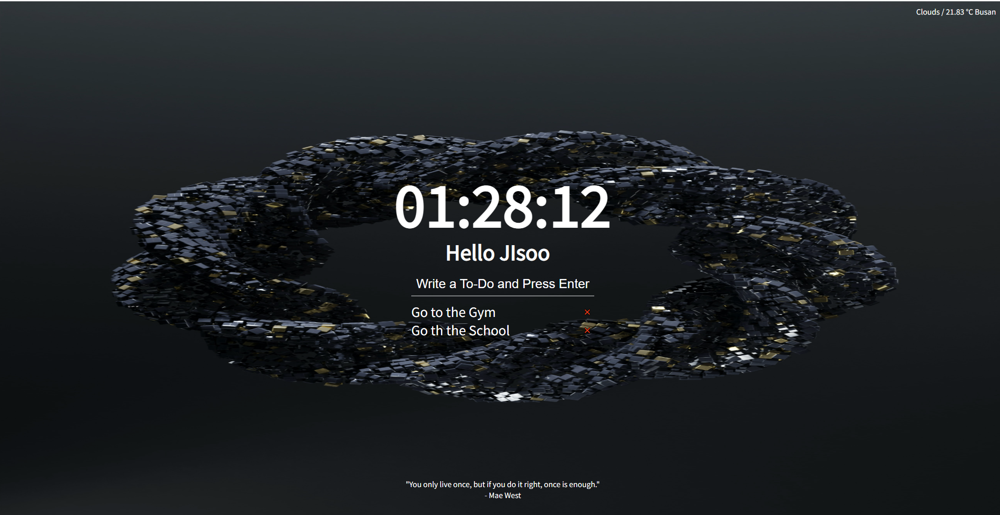

# MOMENTUM Clone Coding Repository
> [노마드 코더](https://nomadcoders.co/)의 바닐라 JS로 크롬 앱 만들기 강의를 수강하며 만든 프로젝트입니다.

## 개발 환경
- Chrome
- VisualStudioCode
- NodeJS
- firebase

## Todo
- [x] LOGIN 
- [x] CLOCK
- [x] QUOTES AND BACKGROUND
- [x] TO DO LIST
- [x] WEATHER
- [x] CSS

## Project result
<a href="https://momentum-njs0921.web.app/">Go to page</a>

## What I learned

        1. console.dir()를 이용하면 해당 오브젝트의 자세한 정보, 속성을 알 수 있다.
        2. Style 영역은 CSS에서 따로 처리하는게 좋다. 자바스크립트로 클래스를 부여하여 처리하자
            2-1. 자바스크립트에서 classList 메서드의 contains/add/remove/toggle 속성 활용
        3. 콜백 함수를 사용하는 함수들은 콜백 함수에 어떠한 정보를 함께 넘겨준다!
            3-1. addEventListener의 "click","submit" 이벤트에 대한 정보 첫 번째 인자로 제공
            3-2. 이 인자의 preventDefault() 메서드를 사용하면 브라우저의 기본 행동을 차단
        4. 브라우저는 local Storage 를 제공한다. 이 작은 DB는 localhost 내에서만 저장된다.
        5. openweathermap.org API를 이용하면 날씨 정보를 알 수 있다.
        6. navigator.geolocation.getCurrentPosition() 메서드를 이용하면 현재 위치 정보를 알 수 있다.
        7. 자바스크립트 모든 파일에서 사용될 전역 변수는 import/export 기능을 이용하여 사용 가능하다.
            7-1. 단 사용될 스크립트의 type="module"로 지정해야한다.
        8. 반응형 CSS 설정을 잘하자

## Reference
- [노마드 코더](https://nomadcoders.co/)

- [Toptal](https://www.toptal.com/developers/gitignore) 

- [CSS position : absolute일 때 가운데 정렬](https://velog.io/@sklove96/css-absolute-%EC%9D%BC-%EB%95%8C-%EA%B0%80%EC%9A%B4%EB%8D%B0-%EC%A0%95%EB%A0%AC-%EB%B0%A9%EB%B2%95)

- [Google Fonts](https://fonts.google.com)

- [button CSS](https://getcssscan.com/css-buttons-examples)

- [openweathermap](https://openweathermap.org/)

- [unsplash](https://unsplash.com/)